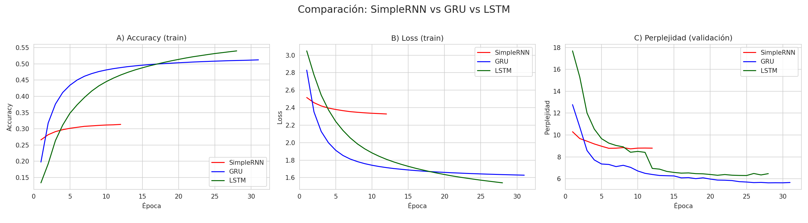

Perfecto, aquí te dejo un **README.md más detallado** que incluye las imágenes y un contexto más completo para tu repositorio:

---

# 📄 Character-Level Language Model con RNN, LSTM y GRU

Este proyecto implementa y compara modelos de lenguaje carácter a carácter utilizando tres arquitecturas recurrentes: **SimpleRNN**, **LSTM** y **GRU**. El objetivo es predecir el próximo carácter en una secuencia de texto y generar texto nuevo empleando estrategias como *greedy search* y *beam search* (determinista y estocástico).

---

## 📂 Estructura del repositorio

* **`4_modelo_lenguaje_char.ipynb`** – Notebook principal con preprocesamiento, entrenamiento, evaluación y generación de texto.
* **`architectures.py`** – Definición de las clases de modelos:

  * `SimpleRNNModel`
  * `LSTMModel`
  * `GRUModel`
* **`callbacks.py`** – *Callback* personalizado `PplCallback` para calcular perplejidad, guardar el mejor modelo y detener el entrenamiento si no hay mejoras.
* **`text_generator.py`** – Funciones para generación de texto y *beam search*.
* **`model_comparison.png`**, **`top15_categories_hist.png`**, **`top_categories_words_sum.png`** – Gráficos de resultados y análisis exploratorio del corpus.

---

## 📊 Análisis exploratorio del corpus

El corpus seleccionado proviene de artículos científicos (dataset de arXiv), filtrando las categorías más relevantes y las palabras más frecuentes en resúmenes.

**Top 15 categorías más frecuentes**


**Palabras totales por categoría (top 100 resúmenes seleccionados)**


---

## 🏗️ Modelos implementados

Las arquitecturas se entrenaron para aprender representaciones carácter a carácter y generar texto.

**Comparación de Accuracy, Loss y Perplejidad**


**Principales observaciones:**

* **GRU** obtuvo el mejor equilibrio entre velocidad de convergencia y perplejidad final.
* **LSTM** logró buena capacidad de generalización, aunque con más coste computacional.
* **SimpleRNN** presentó limitaciones en dependencias largas y mayor perplejidad.

---

## 🚀 Estrategias de generación

Se implementaron tres métodos para generar texto:

1. **Greedy Search** – Selecciona siempre el carácter más probable.
2. **Beam Search Determinista** – Explora varias trayectorias y selecciona las de mayor probabilidad acumulada.
3. **Beam Search Estocástico** – Introduce aleatoriedad controlada con un parámetro de temperatura, aumentando la diversidad.

---

## ⚙️ Requisitos

```bash
tensorflow>=2.x
numpy
scipy
matplotlib
```

---

## ▶️ Ejecución

1. Clonar el repositorio:

```bash
git clone https://github.com/usuario/char-level-language-model.git
cd char-level-language-model
```

2. Entrenar el modelo ejecutando el notebook:

```bash
jupyter notebook 4_modelo_lenguaje_char.ipynb
```

3. Generar texto usando las funciones en `text_generator.py`.

---

## 📌 Conclusiones

* LSTM y GRU superan a SimpleRNN en tareas con dependencias largas.
* *Beam Search* estocástico con temperatura moderada (\~1.0–1.2) equilibra coherencia y creatividad.
* Un callback de perplejidad permite evaluar de forma más precisa la calidad del modelo.

---

Si querés, puedo armarte también **un ejemplo en el README con código para generar texto usando tu `beam_search`**, de forma que cualquiera pueda probarlo rápido. ¿Quieres que lo incluya?
