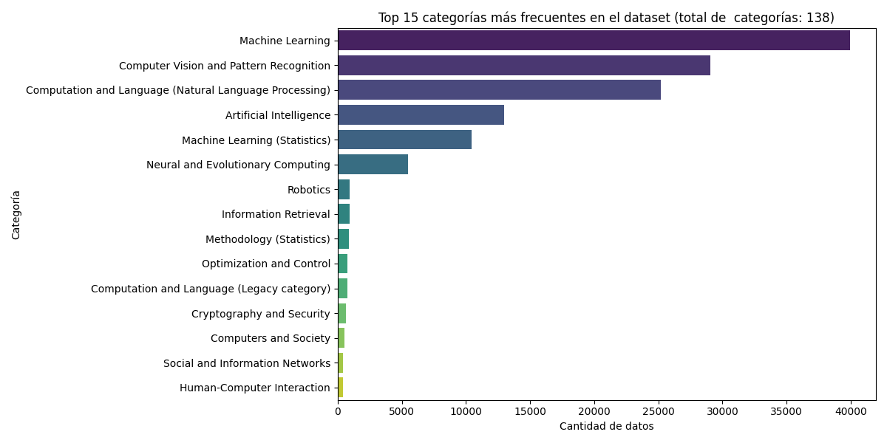
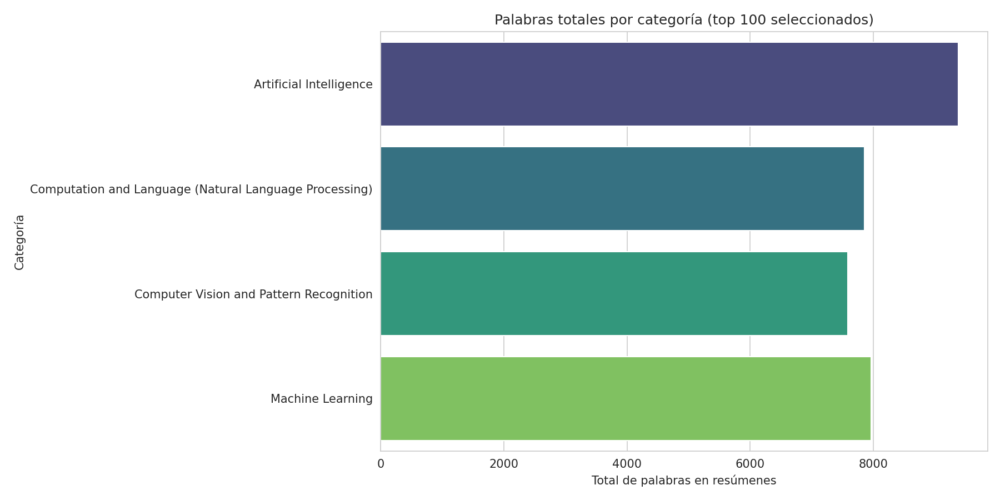
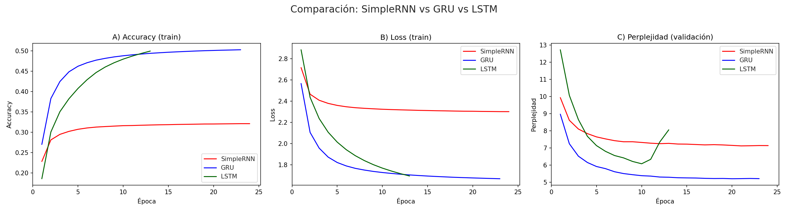

# Desafío 3 – Modelado de Lenguaje a Nivel de Caracteres

### Consigna
- Seleccionar un corpus de texto sobre el cual entrenar el modelo de lenguaje.
- Realizar el pre-procesamiento adecuado para tokenizar el corpus, estructurar el dataset y separar entre datos de entrenamiento y validación.
- Proponer arquitecturas de redes neuronales basadas en unidades recurrentes para implementar un modelo de lenguaje.
- Con el o los modelos que consideren adecuados, generar nuevas secuencias a partir de secuencias de contexto con las estrategias de greedy search y beam search determístico y estocástico. En este último caso observar el efecto de la temperatura en la generación de secuencias.

### Sugerencias
- Durante el entrenamiento, guiarse por el descenso de la perplejidad en los datos de validación para finalizar el entrenamiento. Para ello se provee un callback.
- Explorar utilizar SimpleRNN (celda de Elman), LSTM y GRU.
- rmsprop es el optimizador recomendado para la buena convergencia. No obstante se pueden explorar otros.

## Metodología propuesta
#### 1. Selección del corpus:
Se utilizó el dataset [**ArXiv Scientific Research Papers Dataset**](https://www.kaggle.com/datasets/sumitm004/arxiv-scientific-research-papers-dataset), compuesto por artículos de arXiv en áreas como inteligencia artificial, aprendizaje automático, informática y matemáticas.
Para este trabajo, se seleccionaron **500 artículos** de forma aleatoria del conjunto de datos original. De cada una de las **cuatro categorías dominantes**, se tomaron los **25 resúmenes más extensos**, y los resúmenes se concatenaron en un único texto continuo para su análisis. La categoría "Machine Learning (Statistics)" fue recategorizada a "Machine Learning" para unificar los datos.

**Figura 1.** Top 15 categorías más frecuentes en el dataset.

Como se muestra en la figura 1, las categorías dominantes en el corpus seleccionado son **Machine Learning**, **Computer Vision and Pattern Recognition**, **Computation and Language (Natural Language Processing)** y **Artificial Intelligence**.

**Figura 2.** Cantidad de palabras según las categorías seleccionadas.

La figura 2 muestra que el corpus final tiene una distribución uniforme de la cantidad de palabras entre las cuatro categorías seleccionadas, lo que ayuda a evitar un sesgo significativo del modelo hacia una sola disciplina.

#### 2. Preprocesamiento del texto:
El corpus fue sometido a un proceso de preprocesamiento que incluyó:
* **Conversión a minúsculas.**
* **Tokenización carácter a carácter.** Se extrajeron los caracteres únicos del texto, se convirtieron a minúsculas y se crearon dos diccionarios: `char2idx` (carácter -> índice) e `idx2char` (índice -> carácter).
* **Codificación de los caracteres mediante índices enteros.** El texto completo se convirtió en una secuencia de índices numéricos utilizando el diccionario `char2idx`.
* **Estructuración del conjunto de datos en secuencias de longitud fija.** Se definió un tamaño de contexto de **100 caracteres** (`max_context_size`). Las secuencias se estructuraron bajo un esquema *many-to-many*, en el que cada salida es la entrada desplazada un carácter hacia adelante.
* **División en conjuntos de entrenamiento y validación.** El 90% del corpus tokenizado se usó para entrenamiento y el 10% final para validación.

---

#### 3. Diseño del modelo:
Se exploraron distintas arquitecturas de redes neuronales recurrentes para la tarea de modelado de lenguaje:
* **SimpleRNN:** Utiliza una representación de entrada con codificación `one-hot`, seguida de una capa `SimpleRNN` y una capa `Dense` para la predicción del siguiente carácter.
* **GRU:** A diferencia del modelo `SimpleRNN`, esta arquitectura usa una capa de `Embedding`, dos capas `GRU` y salida `Dense`.
* **LSTM:** Similar a la GRU, esta arquitectura usa una capa de `Embedding`, dos capas `LSTM` y salida `Dense`.

El entrenamiento se configuró con el optimizador **RMSprop** con una tasa de aprendizaje de 0.001.

---

#### 4. Entrenamiento:
Los modelos fueron entrenados aplicando la perplejidad desde un *callback* personalizado llamado `PplCallback`. Este callback se utilizó para:
* **Calcular la perplejidad** sobre el conjunto de validación al final de cada época, usando la fórmula:
    $$
    \mathrm{PPL}(X) = \exp\!\left(-\frac{1}{t}\sum_{i=1}^{t}\log p_{\theta}(w_i \mid w_{<i})\right)
    $$
* **Implementar *Early Stopping*** con `patience=3` para evitar el *overfitting*.
* **Guardar automáticamente** el mejor modelo con la menor perplejidad de validación.

**Resultados de entrenamiento:**
**Figura 3.** Comparación de modelos durante el entrenamiento.

* **SimpleRNN:** Tuvo el peor desempeño, con valores de pérdida y perplejidad significativamente más altos.
* **GRU:** Presentó el mejor rendimiento, alcanzando la menor perplejidad en validación.
* **LSTM:** Tuvo un buen rendimiento, pero mostró indicios de *overfitting* a partir de la época 10.

---

#### 5. Generación de texto
Los modelos entrenados se usaron para generar nuevas secuencias a partir de contextos semilla como `recurrent neural network`, `convolutional neural network` y `future researchs should`.

* ***Greedy search:*** Esta estrategia, que selecciona el carácter más probable en cada paso, resultó en secuencias altamente repetitivas y predecibles. Por ejemplo, en los modelos **GRU y LSTM** se obtuvieron secuencias como "of the probability of the probability...", mientras que en el **SimpleRNN** se generó "to the the the the...".

* ***Beam search determinista:*** Similar a la búsqueda *Greedy*, este método también produjo texto muy repetitivo, como "the probability of the probability...".

* ***Beam search estocástico:*** La incorporación de muestreo probabilístico controlado mediante un parámetro de temperatura permitió analizar su impacto en la diversidad y coherencia de las secuencias generadas.
    * Con **temperatura baja (`TEMP = 0.5`)**, el texto fue más variado, pero aún con repeticiones. Por ejemplo, el modelo GRU generó la secuencia: "future researchs should of the problem of the results in the problems of the problem and the computation of the computation".
    * Con **temperatura alta (`TEMP = 1.5`)**, el texto de la SimpleRNN se volvió incoherente, pero los modelos GRU y LSTM mostraron una gran creatividad y coherencia. Un ejemplo del modelo GRU fue: "future researchs should a related and dependent the clearning computer and the frameworks where the distrated to the propos".

---

#### 6. Conclusiones:
* **GRU y LSTM** superaron a **SimpleRNN** en la gestión de dependencias largas, siendo el modelo **GRU** el más eficaz y de mejor rendimiento.
* La combinación más exitosa fue **GRU + Beam Search Estocástico + Temp = 1.5**, ya que logró el mejor balance entre la coherencia y la creatividad del texto generado.
* El modelado a nivel de carácter es poco efectivo para generar texto coherente en este dominio, pero el uso de arquitecturas robustas y estrategias de decodificación adecuadas mejora significativamente la calidad de los resultados.
