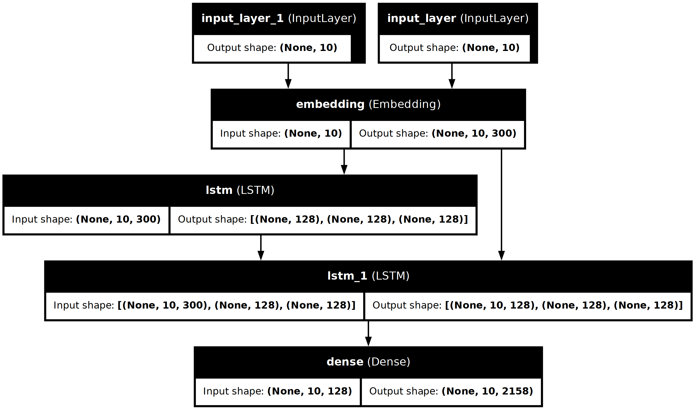
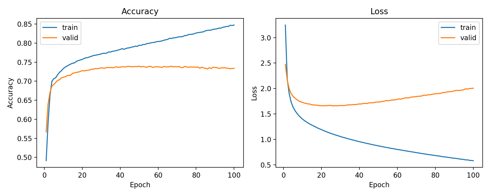

# Modelo Seq2Seq (*Keras*) con un solo vocabulario y embedding compartido

Este proyecto consistió en entrenar un modelo encoder–decoder (*seq2seq*) basado en LSTM para generar respuestas en inglés a partir de pares de diálogo. La principal decisión de diseño fue utilizar un único tokenizador y un solo vocabulario tanto para las entradas como para las salidas, junto con una única capa de *embedding* compartida entre encoder y decoder. Esta estrategia simplificó el pipeline, evitó desalineaciones en los índices y redujo significativamente el consumo de memoria.

---

## Objetivo
* Desarrollar un sistema de diálogo sencillo en inglés, trabajando con pares pregunta → respuesta.
* Utilizar un único vocabulario (un solo Tokenizer) y una única matriz de embeddings (*GloVe* o *fastText*) reutilizada en ambas partes del modelo.
* Realizar la inferencia paso a paso, incorporando tokens especiales de inicio y fin de secuencia

---

## 1. Datos

* El dataset estuvo formado por conversaciones; de cada línea se extrajeron parejas consecutivas (entrada, salida).
* Se descartaron pares demasiado largos para evitar explotar memoria y estabilizar el entrenamiento (longitudes máximas típicas: 10–30 tokens).
* Se agregaron marcadores:

  * `<sos>` (start-of-sequence) al inicio de la salida *para el decoder input*.
  * `<eos>` (end-of-sequence) al final de la salida *para el decoder target*.

Limpieza recomendada
Se usaron minúsculas, normalización básica de contracciones en inglés, y filtrado de símbolos para dejar solo caracteres alfanuméricos/espacios. Fue importante reasignar los reemplazos (evitar funciones “no in-place”).

---

## 2. Vocabulario y tokenización

* Se usó un solo tokenizador entrenado con la unión de:

  * entradas,
  * salidas con `<eos>`,
  * salidas de entrada del decoder con `<sos>`.
* El tamaño del vocabulario se recortó a un máximo (p. ej., 8 000) y se reservó el índice 0 para padding.
* `<sos>` y `<eos>` debieron existir en el vocabulario y tener índices > 0.
* Todas las secuencias fueron paddeadas a longitudes fijas separadas: `max_input_len` para el encoder y `max_out_len` para el decoder.

---

## 3. Embeddings

* Se empleó un único conjunto de embeddings en inglés (*fastText*).
* Se construyó una sola matriz de tamaño *(vocab, dim)* usando el mismo diccionario del tokenizador.
* Detalle crítico: cuando se consultó el embedding de una palabra, se tuvo que tratar la palabra como unidad léxica, no como lista de caracteres. (En términos prácticos: la función que obtuvo embeddings tuvo que recibir un conjunto/lista de palabras, no un string suelto).
* Las palabras fuera del vocabulario de los embeddings quedaron con vector nulo; convino monitorear la cobertura (proporción de palabras con vector no nulo).

Elección del embedding
* fastText (p. ej., wiki-news-300d): ofreció mejor cobertura por subpalabras, a costa de mayor tamaño.
`class FasttextEmbeddings(WordsEmbeddings):
  WORD_TO_VEC_MODEL_TXT_PATH = 'cc.en.300.vec'
  PKL_PATH = 'fasttext.pkl'
  N_FEATURES = 300
  WORD_MAX_SIZE = 60`

---

## 4. Arquitectura del modelo

* Embedding compartido (no entrenable, con máscara de padding activada): una sola capa que transformó IDs de tokens en vectores, usada tanto por encoder como por decoder.
* Encoder: LSTM con 128 unidades (configurable), con `dropout` y `recurrent_dropout` típicamente en 0.2.
* Decoder: otra LSTM de 128 unidades que recibió el estado final del encoder. Produjo una secuencia de logits que se proyectó con una capa densa al tamaño del vocabulario compartido.
* Función de pérdida: entropía cruzada categórica sobre la salida del decoder (one-hot o soft labels).
* Métrica: `accuracy` a nivel de token (útil para seguimiento; no siempre correlacionó con calidad lingüística).

---

## 5. Entrenamiento

* Se entrenó con *teacher forcing*: el decoder vio la secuencia de salida “real” desplazada por `<sos>`.
* Se realizó una partición 80:20
* Épocas típicas: 100
  
### 5.1. Monitoreo
* Las curvas del accuracy y loss mostraron lo que pareció ser un overfitting, sin embargo, el accuracy no fue una buena métrica para lenguajes de procesamiento de lenguaje natural.

---

### 5.2. Inferencia (decodificación)

* Se construyó un encoder de inferencia que, dado el input paddeado, devolvió los estados ocultos iniciales del decoder.
* El decoder de inferencia funcionó token a token:

  1. Se inició con `<sos>`.
  2. En cada paso se tomó el token previo, se lo pasó por la misma capa de Embedding compartida, se propagó en el LSTM junto con los estados, y se obtuvo una distribución sobre el vocabulario.
  3. Se seleccionó el siguiente token (greedy).
  4. Se detuvo al predecir `<eos>` o alcanzar la longitud máxima.

> Clave: el decoder de inferencia reutilizó exactamente las mismas capas y pesos del entrenamiento (Embedding, LSTM y Dense). No se crearon capas nuevas “en blanco”.

Ejemplos de inferencia:
* *Input:*  🧔🏽‍♂️  what do you do for a living
* *Output:* 🤖 i am a student
  
* *Input:*  🧔🏽‍♂️  Do you read?
* *Output:* 🤖 yes
  
* *Input:*  🧔🏽‍♂️ Do you have any pet?
* *Output:* 🤖 yes i have a tiger
  
* *Input:*  🧔🏽‍♂️ Where are you from?
* *Output:* 🤖 i am from the united states

---

### Conclusiones

Un solo vocabulario y un solo Embedding simplificaron el entrenamiento y la inferencia, evitando errores de índices y reduciendo la memoria. La consistencia entre tokenizador, matriz de embeddings y capas (mismos tamaños e índices) fue la clave para resultados estables. Con limpieza adecuada, cobertura de embeddings razonable y un pipeline de inferencia que reutilizó las mismas capas entrenadas, el sistema produjo respuestas muy coherentes para diálogos simples en inglés.
